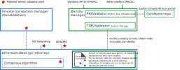

```
EEP: TBC
Title: EEA Identity and Permissioning
Version: 0.1
Author: Peter Broadhurst, Jim Zhang
Type: EEA Standard
Status: Draft
Working Group: Standards
Created: 2018-02-10
Requires (*optional): N/A
Replaces (*optional): N/A
```

# Identity and Permissioning

Identity is critical to a permissioned Enterprise Ethereum network. Every entity within the network must be able to establish the identity of other entities in the network. The entities that require identities are varied and elaborated in this document, including nodes and other infrastructure components, applications, individuals, and most critically the organizations that participate in the consortium.

Network membership permissioning should work at the organizational level. An organization gets added to the network membership management and establishes its trust anchor. Then the organization can freely add or remove individual identities belonging to it.

There are circumstances where masking of identity is required in shared transaction data, such that the transaction participants are not revealed to non-participants of the transaction.

In still other circumstances, transaction data must be transferred privately between participants.

The standard in this document describes a set of identity and permissioning requirements that an Enterprise Ethereum solution **shall** meet, and an example architecture for establishing identity via an interface that could be implemented independently as multiple Enterprise Ethereum implementations, or shared as a pluggable component.

## Index

1. Types of Identity
   1. Individual Identity
   1. Organizational Identity
1. Entities in the Network
   1. Organizations
   1. Ethereum Accounts
   1. Nodes
   1. Smart Contracts
   1. Decentralized Applications (DApps)
   1. Application Instances
   1. Shared Applications
   1. End Users
1. Establishing Identity
   1. Domains of Trust
   1. Trust Anchors
      1. Public Key Infrastructure (PKI)
      1. Oracles
   1. Trust on First Use (TOFU)
   1. Enhancing TOFU with Policy
   1. Hierarchical Deterministic (HD) Wallets
1. Permissioning
   1. Consensus
   1. Network Ingress
   1. Transaction Submission
   1. Smart Contract Creation
1. Identity Manager Component 

## Types of Identities

Entities that exist within an Enterprise Ethereum network can be largely categorized as **Individual** and **Organizational** identities. An organizational identity is a collection of individual identities that are endorsed by a trusted authority that can vouch for the validity of the individual identity's organizational association. Different kinds of endorsement by the trusted authority will be described in details.

### Organizations

A permissioned Enterprise Ethereum network exists to provide a shared ledger between a consortium of organizations. The organizations that are participants in the network **shall** be identifiable to all other organizations in the network, and **shall** be able to prove their ownership of technical components with identities that **can** be created within the network.

Organizations **must** provide a way to establish the identity of other entities that they own, a.k.a a **trust anchor**, via some hierarchical system of trust as discussed later in this document.

Organizations **will** be held accountable for the actions of the individual identities that are endorsed by the organization's trust anchor.

Organizations **should** appropriately secure ingress into and out of the ethereum network. But every node in the network **must always** validate incoming requests from other nodes via the p2p network based on the permissioning mechanism.

[**To be discussed further**] There **can** be cases where anonymous entities are given permission to submit transactions and data into the network, without first establishing an identity within that network. A choice to allow anonymous participation in a permissioned network has significant implications beyond the scope of what is covered in this document.

### Individuals

An individual identity in an Enterprise Ethereum network represents a member of an organization. In the context of today's cryptography, an individual identity is a key pair, or [an ethereum Externally Owned Account](https://github.com/ethereum/wiki/wiki/White-Paper#ethereum-accounts). It is used for digital signing and encryption purposes. An organization does not hold keys itself but instead designate individual identities as members who then hold the keys. An organization can designate certain individuals to have special roles that are established in the consortium, such as a blockchain administrator of the organization, which may be required to carry out certain highly privileged operations such as inviting other organizations or accepting an invitation on behalf of the organization.

Roles can be established using identity attributes, which will be discussed in more details.

An individual identity proves its organizations association through the endorsement of the trust anchor. The form of the proof is dependent on the trust system employed by the network. For example, if the network uses Public Key Infrastructure (PKI) then the proof is presented in the form of a public certificate signed by the organization's Certificate Authority (CA). The organization's CA must have been established as a trust anchor in the network apriori.

. In itself an ethereum account does not represent any form of identity. It is an address where asymmetric cryptography **shall** ensure only the holder of the associated private key is able to submit transactions from that address. In order to establish the identity associated with an account, some commonly agreed root of trust **shall** be established between all participants in the network.

A number of approaches to establishing identities, and linking an identity to an ethereum account are discussed later in this document.

## Technical Components Holding Identities

Now we discuss where identities must exist for an Enterprise Ethereum network to function.

### Nodes

A node is an independently maintained instance of a transaction ledger, that **can** participate in establishing consensus to add a block to the shared ledger. Individual nodes **need not** participate in establishing consensus of every block, and some nodes **may** act in an observer role validating transactions and adding them to the chain, without ever participating in consensus.

All nodes **should** be permissioned in an Enterprise Ethereum network by proving its organizational association. In other words, an organization that has established its trust anchor can freely add any number of nodes, so long as the nodes' identities are properly endorsed.

All nodes **must** have security in the form of encryption (TLS) and access control (digital signature based) applied to all network interfaces for communication with other nodes in the network.

All nodes **should** have TLS with their applications, and **may** choose to use access control based on digital signatures or other means of authentication such as OAuth.

> The relationship between organization and node identities, and the formation of consensus for mining new blocks is discussed later in this document.

As well as maintaining a copy of a ledger, nodes are the gateways by which external transactions are submitted into the network. Nodes **can** expose both IPC and Network interfaces for the submission of transactions into the network.

##### Externally Owned Accounts Managed by Nodes

Nodes **may** hold the private keys of multiple Ethereum accounts, in order to sign transactions that are submitted over a network interface to that node. For example an application connecting over JSON/RPC to a node **can** submit a transaction to create a smart contract, or send data to an existing smart contract, without first having signed that transaction. The node **can** then sign the transaction using a private key the node has access to, that the application sending the transaction does not have access to.

As such the node **can** provide a point of identity aggregation and/or masking, where multiple external identities are able to submit transactions into the network that result in the use of the same ethereum account.

[**Suggest removing this section, smart contract isn't a good place to hold indentities as it's distributed as a shared component among participants**]
### Smart Contracts

Once deployed a smart contract is assigned an ethereum account address, which **can** be linked to an identity via the approaches discussed in this document. Smart contracts can then submit transactions to other smart contracts, and can use state to prevent access to the smart contract from unauthenticated addresses, as long as the state required to establish the identity of the transaction submitter is available on the blockchain.

As such a smart contracts **can** provide a point of identity aggregation, and **may** contain logic and interfaces to allow management of that identity aggregation. Common use cases include recovery of identity in the case that the private keys for an external account are lost, or the establishment and management of an organizational identity.

#### Private Smart Contracts

In a permissioned Enterprise Ethereum network with a private transaction manager, there **may** be ethereum smart contracts that are both stored and executed outside of the consensus of the common permissioned ledger. While the smart contract code and state completely detached from the common permissioned ledger, the fact that an ethereum account address is used as the identifier of that private smart contract **may** be exploited to provide a common approach to establishing the identity of both private and public smart contracts via a common root of trust.

### Decentralized Applications (DApps)

Decentralized applications (DApps) are the combination of multiple application instances that **may** be implemented and/or hosted by different organizations, and a set of smart contracts with well defined programming interfaces that hold common state. Assigning an identity to the overall decentralized application is beyond the the scope of this document. However, the individual application instances and smart contracts that participate in the overall DApp are considered.

### Application Instances

Individual application instances **can** connect to a node and submit transactions into the network.

> It is common to refer to an individual application instance that participates in a blockchain solution as a 'a DApp' even though the overall decentralized application **should** consist of multiple application instances.

Application instances **may** manage multiple identities, and either propagate or aggregate these identities to identities associated with ethereum accounts:

- Identity of end-users who connect to the application
  - Such as OAuth 2.0 authentication to connect to an application via web/mobile
- Identity of end-users on the ethereum blockchain
  - Such as using a deterministic wallet to associate ethereum accounts within the administrative domain of that application instance, to individual ethereum accounts
- Aggregated identities
  - Such as exploiting existing enterprise identity registries such as LDAP to establish membership of a particular business unit/function, and submitting transactions under accounts linked to an identity for that business unit/function
- Identity of the application itself to connect to a node
  - The application **should** be scaled and hosted separately from the node, and as such network security such as TLS mutual authentication, OAuth 2.0, API keys, or HTTPS basic authentication **shall** be used when the application connects to the node
  - If the application instance is colocated with the node, then operating system security **can** be used to establish application identity

Application instances **may** be owned by the same organization as the nodes it uses to connect to the network, so that other participants in the network **can** isolate that application from the network by evicting the organization's nodes in the case of a technical or security failure, or business decision, without requiring access to the IT infrastructure upon which the application itself executes.

### Shared Applications

Application instances **may** have responsibilities that are required by multiple participants in the network. For example an application that orchestrates a transaction across multiple parties with logic, that is performed primarily outside of the ethereum smart contracts and uses the smart contracts to manage storage of data. Such an application **can** perform sophisticated encryption and orchestration, which **can** require sensitive unencrypted data to be present during the processing, and **can** be considered part of the overall contract being executed via the decentralized application. Such applications **should** be a stateless execution tier that exploits smart contracts and the ethereum ledger for state storage.

In environments where such an application instance exists, a mechanism **should** be in place to provide trust to all parties involved in the consortium that the code executed in that shared application instance is the code that has been agreed. As the ethereum network cannot be exploited to provide that trust, some other mechanism must be employed.

##### Trusted Execution Environments

One mechanism that **can** be employed to provide assurance as to the code being executed in a shared application instance hosted by any party, is a cryptographically secured compute environment that can be traced back to a set of executable source code reviewed by all parties involved in the consortium. In general such mechanisms provides trust via remote attestation, such as in the case of Intel SGX.

##### Independent Third Parties

Alternatively a third party can be trusted to host the shared application instance. This third party **may** be a neutral participant in the business consortium, such as a regulator or other independent entity. Or it **may** be an external entity trusted by the consortium.

### End Users

Individual end-user identities **may** be managed by the application instances that they connect to, in the case that those individuals trust the organization that hosts that application.

For example, customers **may** trust the organization hosting that application to manage their identity directly, or indirectly via a system such as OAuth 2.0 with a 3rd party identity provider.

Employee identities **may** be managed on behalf of end-users using traditional enterprise user registries such as a LDAP and mapped to one or many ethereum accounts as part of the application instance. Or ethereum identities might be managed automatically on a users behalf by linking an enterprise process for employee on-boarding, to a deterministic wallet managing those keys on the users behalf.

End-users **may** instead be empowered to manage their own identities, via an application that lets them secure their private keys on devices such as computers and mobile phones, with appropriate security controls.

### Devices

In an IoT world, devices can be an important part of a blockchain based solution. Devices acquire identities similarly to applications, by either hosting the keys locally, such that all the transactions it emits are signed, or by authenticating with a gateway computer via other means (Basic Auth, OAuth, API Keys, etc.) and have the gateway sign the transactions on its behalf. Techniques to use to secure the devices and secure the communications with the blockchain is similar to that of the end users.

## Establishing Identity

In order for an identity to be established within a permissioned network, there **shall** be a common mechanism for all participants in the network to establish trust of an identity. That mechanism **can** be centralized via a system of inheritance from a trusted root, or it **can** be decentralized via consensus between the parties inside of the permissioned network.

### Domains of Trust

It **need not** be the case that every type of identity described in this document is verifiable by every organization participant in the network. Depending on the use case trust **may** be delegated within a domain. For example, an organization **may** be trusted to authenticate the identity of its employees that access an instance of its decentralized applications, via existing enterprise identity registry.

It **should** be the case that organizations are able to efficiently manage their own resources, including in the case where the identity of those resources need to be established by other resources in the network. Commonly an inheritance of trust is employed for this purpose, where organizations have a domain of trust within which they are empowered to create new identities.

For example, an organization **may** be empowered to create new nodes owned by their organizational identity, and have these nodes join the network, without infrastructure changes happening on other nodes in the network. Such a change might need to conform to certain policy constraints, such as a maximum number of nodes per organization, that have already been established within the network.

### Trust Anchors

In order to allow components within the network to establish the identity of other components within the network, there **shall** be a set of trust anchors that components owned by every participant in the network **can** use to validate the identity as trusted within the network.

#### Public Key Infrastructure (PKI)

PKI is well established as the trust anchor of the internet, with a well known set of root authorities able to provide a trust anchor in a hierarchical model. These trusted root CAs **may** be used to validate the organizational identity, and issue an intermediate certificate. This intermediate certificate can be used by that organization to sign certificates for the individual resources it owns. The chain of signing of a certificate, combined with standardization on the generation of fields in the Common Name (CN) can be used to tie the individual identity of an entity, to the identity of the organization that created that entity.

Private Certificate Authorities **may** also be used in such an environment. For example, by having a single root certificate generated for each organization and distributed via a trusted delivery mechanism to each participant.

If a suitable third party exists who's identity **can** be trusted by all parties, then that third party **may** act as a root certificate authority for the network. Thus eliminating the need to distribute the organizational intermediate certificates to each party in the network.

#### Oracles

The decentralized nature of the ethereum ecosystem, and permissioned ethereum networks, **may** make the approach of exploiting the existing trusted certificate authorities in the centralized PKI infrastructure unsuitable for some networks. In these cases a decentralized hierarchy of identity could be managed either on the permissioned chain itself, or in the public ethereum ecosystem.

In such a system x.509 certificates **can** continue to be used as the technology for encoding and signing identity, while the certificate authorities are replaced with Smart Contracts that govern the lifecycle of trust of those certificates.

### Trust on First Use (TOFU)

A fully decentralized approach to security in permissioned ethereum network **may** by appropriate, particularly in networks that need a low barrier of entry to new participants. TOFU **can** provide a decentralized solution, delegating responsibility for validation of a new identity out to the existing members of the network.

Given the example of a new node joining a network, that node would attempt to connect to a number of existing nodes using an identity token. This action would result in some administrative prompt to administrators of those nodes to choose whether to accept that identity token. Administrators would need to use out-of-band communications mechanisms to ascertain whether the new node is expected, and maybe supporting technical details such as the originating IP address. 

Once accepted by that node, the node **shall** persist details of the new node and beginning accepting and forwarding p2p communication to that node. If any change is detected in the identity token being used then connections are rejected.

All nodes receiving direct or indirect p2p communication with that node would perform the same TOFU validation. Depending on the consensus algorithm used within the network, the new node **should** not be able to mine new blocks until it has convinced a suitable proportion of existing nodes to accept its identity.

### Enhancing TOFU with Policy

TOFU **can** be enhanced by exploiting the ethereum ledger to track the votes of individual administrators accepting the joining of a new node. A policy enforced via a smart contract **can** be used by an identity validator component to enforce a threshold of existing identities that must vote via TOFU to add a new identity before all members trust that identity.

### Hierarchical Deterministic (HD) Wallets

HD Wallets **may** be used to managing large quantities of identities that have a one-to-one relationship with an ethereum account, such as employees within a company. An arbitrary number of accounts can be generated and distributed to employees, and all of these keys can be used to submit transactions through the application instances and nodes owned by that organization.

In order for other participants in a network to validate an account is owned by an organizational identity, an organization **may** provide an off-chain network interface to validate an account using its HD Wallet.

## Permissioning

Given an established mechanism for establishing identity, these identities **shall** be used to enforce permissions throughout the network.

All clients in a single permissioned network **shall** enforce the same set of permissions upon the same identities. Some mechanism **should** be employed during the process of on-boarding a new organization to a permissioned network validate that the technology and configuration has been performed correctly.

### Roles

In addition to identity, role-based access control **should** be provided to control the actions that can be performed by a particular identity.

Role based permissions **may** be managed via state and policies stored within the permissioned ethereum ledger, visible to all participants in the network. For example the identities of application instances that are allowed to invoke a particular smart contract **may** be visible to all participants via the ledger. Also the policy by which a new application instance is granted the role required to invoke that smart contract **may** be visible to all participants.

### Consensus

The consensus algorithm in a permissioned network **shall** require every node that participates in consensus has permission to do so.

Consensus algorithms **should** exploit the organizational identity as well as the individual identity of the node in the consensus algorithm, so that organizations are suitably represented in consensus. The approach to achieving this **may** be as simple as having a policy to limit the maximum number of nodes for any individual organization that can join the network. A more sophisticated consensus algorithm **may** take into account organizational votes during each decision.

### Network Ingress

Identity based permissioning **shall** be performed on every network ingress into a component that **can** result in an action within the system or retrieval of data. These include p2p networking between peers and private transaction managers, as well as communications as part of the consensus protocol, and external requests over JSON/RPC into a node.

### Transaction Submission

An externally submitted transaction using an ethereum account **may** be required to meet permissioned identity check before the transaction can be submitted, that is separate to the network level validation performed to connect to the node.

### Smart Contract Creation

A special form of transaction creates a smart contract instance. It **may** be necessary to apply a permission check to the submission of such transactions.

## Identity Manager Component

In order to allow multiple components in a network to make consistent decisions on the establishment of identity, a common component **should** be introduced to be used across the policy enforcement points described in this document.



### Identity Manager Responsibilities

- Pluggable identity validator modules
- Locally secured admin API/CLI
- Well documented API for other components to validate identities
- Identity tokens **shall** be be opaque blocks of data to all other components
- An `individual identity` string is returned
- An `organizational identity` string is also returned

### Example Behavior of a PKI Validator

- The token is an X.509 certificate.
- The validator uses a certificate store on the local filesystem to validate the certificate chain.
- The full CN from the certificate is returned, or a rule based on configuration to extract part of the CN.
- The organization is returned via part of the CN of the signer, or part of the CN of the certificate in the case a strong convention has been established and trusted to be implemented by all organizations.

### Example Behavior of a TOFU Validator

- An instance of the validator exists on each node
- The token is a JWT or other public/private encrypted payload containing an identity
- A policy is installed into to the chain in the form of a smart contract to store identity
- The administrator API/CLI is used to register a TOFU vote for a new identity
- Each identity is pinned to a single ethereum account, that the instance of the identity validator that owns that identity has access to
- The identity validator submits a hash of the identity, under its account, and with its identity 
- The policy defines when a new identity transitions from trusted to untrusted
- The JWT signature cannot change for a given identity

> Incomplete Solidity example demonstrating some of the concepts here
>
> [identity.sol](../src/main/solidity/contracts/identity.sol)
>
> [identity-test.js](../src/main/solidity/test/identity-test.js)

## Policy Decision Point (PDP) Component

In a network with role based permissions a Policy Decision Point is required in addition to the Identity Manager that Policy Enforcement Points (as described above) can invoke to perform policy based decisions upon a validated identity.

